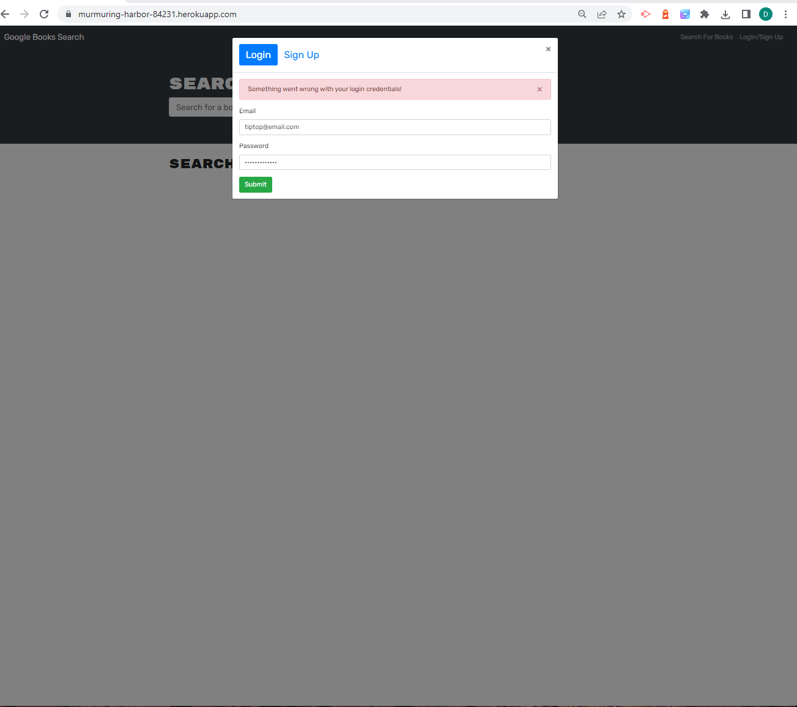
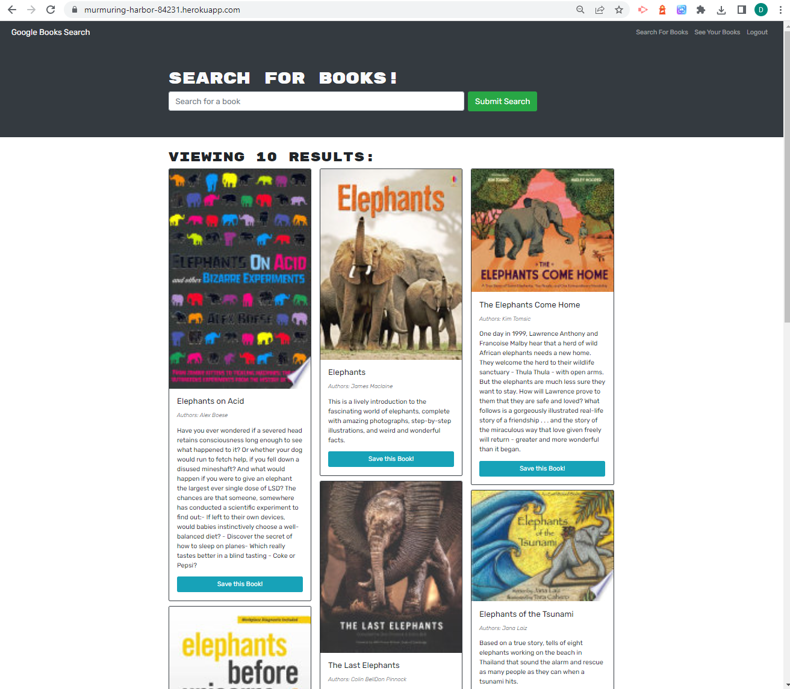
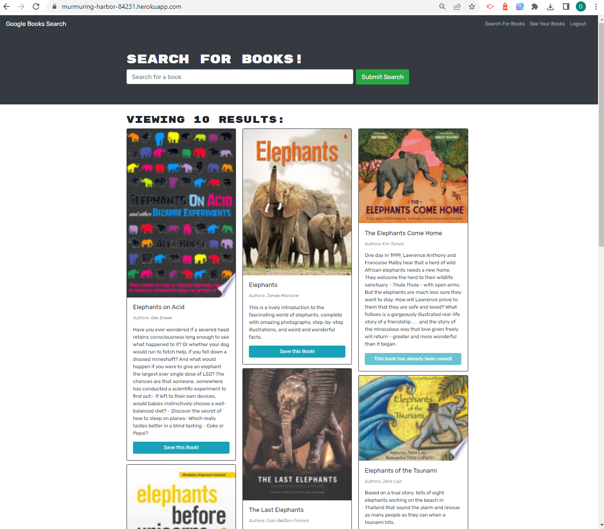
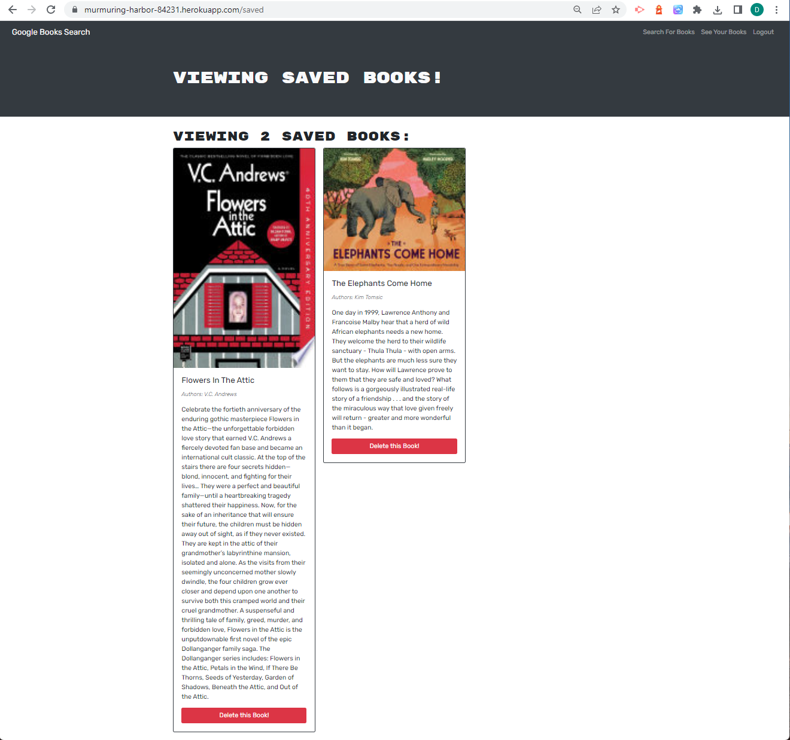
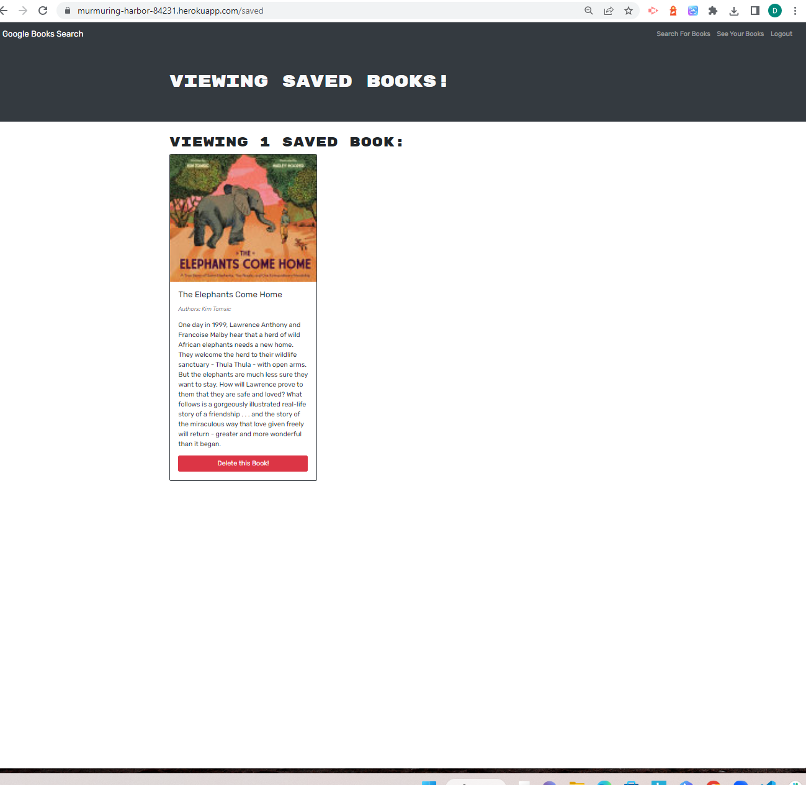

# MERN Book Search Engine [](https://opensource.org/licenses/MIT)  
  
  ## Table of Contents  
  * [Description](#description)
  * [Installation](#installation)
  * [Usage](#usage)
  * [Deployed Application](#walk-through-video)
  * [Screen Shots](#screen-shots)
  * [Tests](#tests)
  * [Technologies Used](#technologies-used)
  * [Questions](#questions) 
  * [How to Contribute](#how-to-contribute)   
  * [License](#license)
  
  ## Description

  This project takes a fully functioning Google Books search engine,  built using the MERN stack with a React front-end that uses a  RESTful API, and refactors  the RESTful API to be a GraphQL API built with Apollo server.  The following steps were taken to replace the RESTful API:

    - Setting up an Apollo Server to use GraphQL queries and mutations to fetch and modify existing data to replace the RESTful API.
    - Authentication middleware was modified to work with a GraphQL API.
    - Apollo provider was created to enable requests to communicate with an Apollo server.
    

     
         
  ### Functional Requirements

  The functional requirements that the Book Search Application was refactored to meet are defined by the user story and acceptance criteria listed below.  

  #### User Story

  ```md
AS AN avid reader
I WANT to search for new books to read
SO THAT I can keep a list of books to purchase
```
 

```md
GIVEN a book search engine
WHEN I load the search engine
THEN I am presented with a menu with the options Search for Books and Login/Signup and an input field to search for books and a submit button
WHEN I click on the Search for Books menu option
THEN I am presented with an input field to search for books and a submit button
WHEN I am not logged in and enter a search term in the input field and click the submit button
THEN I am presented with several search results, each featuring a book’s title, author, description, image, and a link to that book on the Google Books site
WHEN I click on the Login/Signup menu option
THEN a modal appears on the screen with a toggle between the option to log in or sign up
WHEN the toggle is set to Signup
THEN I am presented with three inputs for a username, an email address, and a password, and a signup button
WHEN the toggle is set to Login
THEN I am presented with two inputs for an email address and a password and login button
WHEN I enter a valid email address and create a password and click on the signup button
THEN my user account is created and I am logged in to the site
WHEN I enter my account’s email address and password and click on the login button
THEN I the modal closes and I am logged in to the site
WHEN I am logged in to the site
THEN the menu options change to Search for Books, an option to see my saved books, and Logout
WHEN I am logged in and enter a search term in the input field and click the submit button
THEN I am presented with several search results, each featuring a book’s title, author, description, image, and a link to that book on the Google Books site and a button to save a book to my account
WHEN I click on the Save button on a book
THEN that book’s information is saved to my account
WHEN I click on the option to see my saved books
THEN I am presented with all of the books I have saved to my account, each featuring the book’s title, author, description, image, and a link to that book on the Google Books site and a button to remove a book from my account
WHEN I click on the Remove button on a book
THEN that book is deleted from my saved books list
WHEN I click on the Logout button
THEN I am logged out of the site and presented with a menu with the options Search for Books and Login/Signup and an input field to search for books and a submit button  
```

  ## Installation
  
  After cloning the application follow the instructions below to install the application:

    
  Install dependencies:

       npm i

  To run the application:

    npm run develop
  
  The application will run locally on your browser at localhost:3000

 ## Usage

  A  video demonstrating usage of  the Book Search application is provided in the following link: 

  - [Walk-through video](https://watch.screencastify.com/v/f9uDmVvqOAYWbqmj35Vc)


  
  
 ## Deployed Application

 To use the book search application, click on the link below:

  - [Google Book Search Engine](https://murmuring-harbor-84231.herokuapp.com/)
 

   

   

  ## Screen Shots

The following image shows screen shots of my single-page Portfolio Application, which is dynamically updated using React components. 

#### Login


 

 #### Search results

 


#### Save button changes to indicate book has been saved
 

#### Saved Books

 

 #### Delete Book

 


 


  ## Tests
  No code tests have been implemented.

  ## Technologies Used
  - React JS
  - Bootstrap
  - HTML
  - CSS
  - JavaScript
  - Node JS
  - Express JS
  - apollo-server-express
  - GraphQL
  - MongoDB
  - Mongoose
  - Heroku
  
    
 
  ## Questions
  If you have any questions regarding this project or contents of this repository, please contact me via:
  
  - email: beanalini@outlook.com
  - GitHub: [Beanalini](https://github.com/Beanalini)  


  
  ## How to Contribute
  If you would like to contribute to this project you can contact me by email at dat826@gmail.com or through my GitHub account   @[Beanalini](https://github.com/Beanalini).
  

  ## License
  This project is covered under the MIT License  
  
  [](https://opensource.org/licenses/MIT) 
  